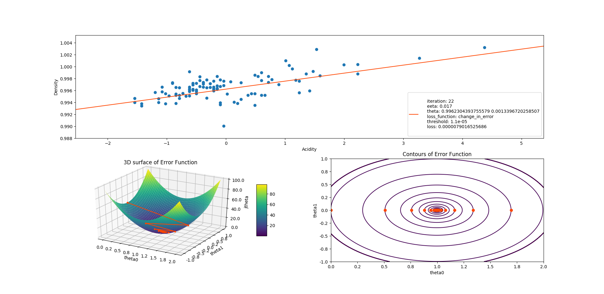
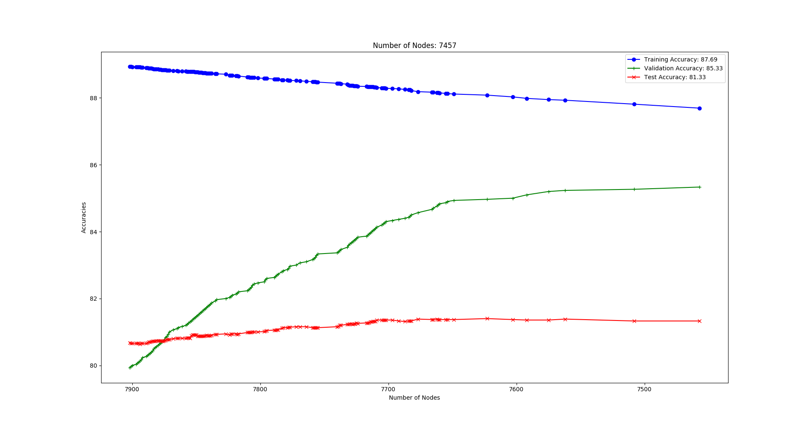
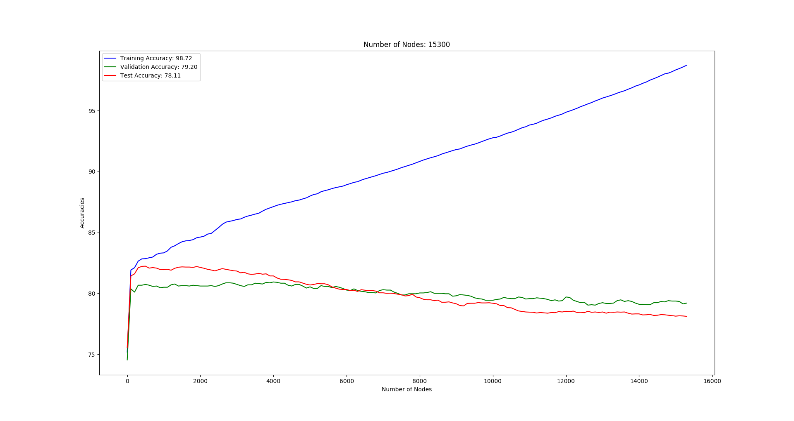
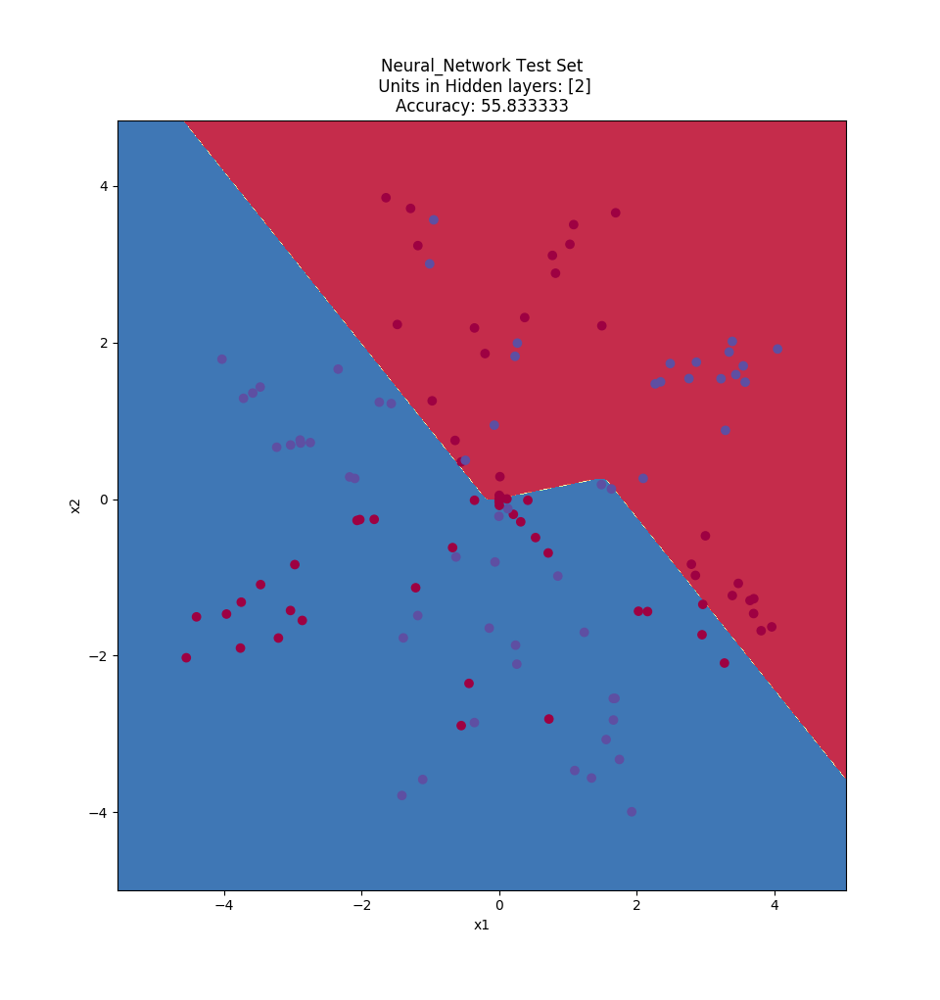
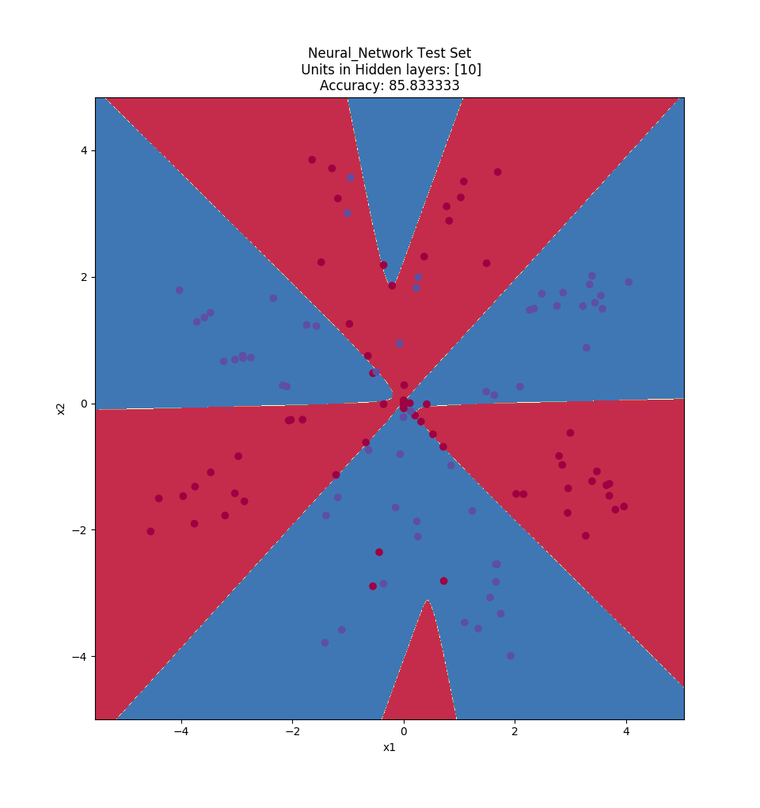
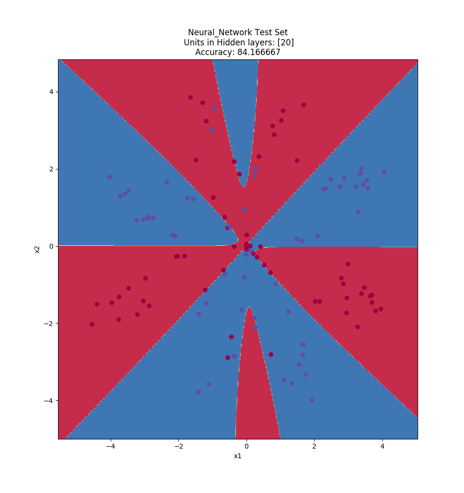

# mcs-ml-assignments
Assignments for the Machine Learning course (COL774) at IITD 

## Assignment 1

**1. Linear Regression using Gradient Descent**

- Leaning Rate(&eta;) = 0.001

- Leaning Rate(&eta;)= 0.017

**2. Locally weighted Linear Regression using Normal Equations**

- Bandwidth(&tau;) = 0.30

**3. Logistic Regression using Newton's Update Method**

**4. Gaussian Discriminant Analysis**

## Assignment 2

**1. Naive Bayes**

- Basic
- +Stemming
- +Stopwords Removal
- +Feature Engineering

**2. SVM**

- MNIST Hand written digit recognition
- Pegasos Algorithm: 92.49% Test accuracy
- LibSVM Linear Kernel: 92.78
- Gaussian Kernel: 97.23

## Assignment 3

### 1. Decision Trees and Random Forests

**a. Decision Trees**

**b. Post Pruning Decision Trees**
- Inefficient Implementation (Takes too much time)

**c. Dynamically calculate median of Numerical Data**

Instead of calculating the median of the numerical data beforehand median at a particular node is calculated dynamically using only the data coming to a particular node.

**d. Scikit Learn Decision Tree and Random Forests**

- Dtree Test acc: 84.80%
- Rforest Test acc: 85.485%

### 2. Neural Network

**a. Implement Neural Network Class**

- Forward Pass: to update outputs
- Backward Pass: backpropogation

**b. Visualizing Decision Boundaries**

- Logistic Regression

- Single Hidden Layer with 1 neuron

- Single Hidden Layer with 2 neurons

- Single Hidden Layer with 3 neurons

- Single Hidden Layer with 5 neurons

- Single Hidden Layer with 10 neurons

- Single Hidden Layer with 20 neurons

- Single Hidden Layer with 40 neurons

- Two Hidden Layers with 5 neurons each

**c. MNIST Handwritten Digits Recognition - 6 & 8**

- SVM Linear: 98.4722% Test accuracy
- Single Perceptron: 98.91% Test accuracy
- 100 units in hidden Layer: 99.1389% Test accuracy

## Assignment 4

**1. K-Means**
